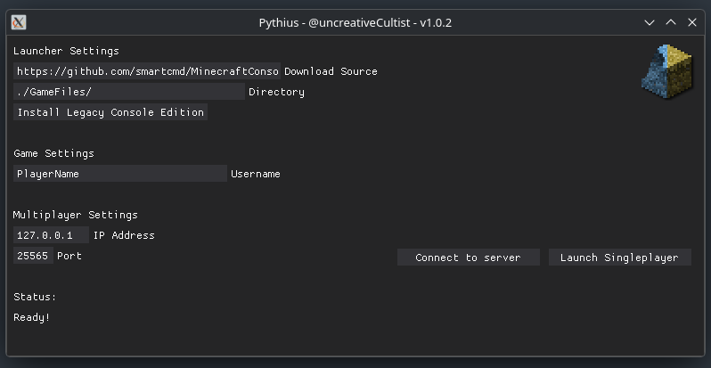

#  Pythius Launcher
A lightweight, cross-platform launcher for a c++ port of a certain game

# Legal notice
Pythius Launcher (hereby referred to as Pythius,) is intended for educational and research purposes only. 
I, uncreativeCultist, along with any other Pythius contributors, do not encourage nor endorse usage of leaked/illicit software. 
**Pythius does NOT, and WILL NOT contain any leaked code, assets, music, etc.**
If you are a rights holder, and believe that Pythius has infringed upon your copyright, please send an email to dmca@cultist.gay.
