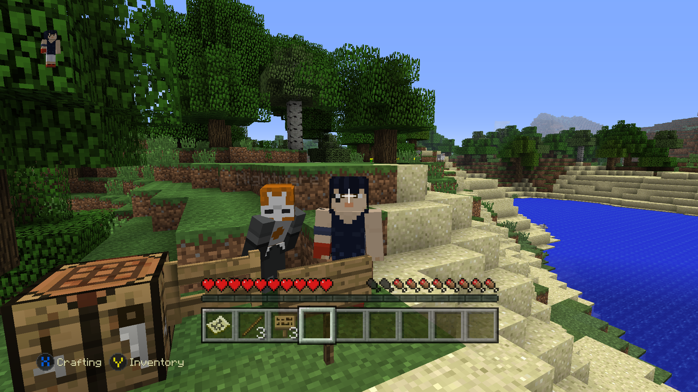

#  Pythius Launcher
A lightweight, cross-platform launcher for a c++ port of a certain game  
Please note, I'm developing this for fun, and in my spare time. Please don't push me to add features!  
If you desperately want something added, feel free to do it yourself and open a pull request! ^^

# Project goals
In order of importance, not necessarily order of implementation.  
  
**Bold** means it is high priority or currently being worked on.  
~~Strikethrough~~ means it will not be implemented, or doesn't fit within the scope of the project.
- [x] Automatically download/install latest build
- [x] Launch game and be able to change settings (i.e: name) without command line
- [ ] **Full multiplayer support**
  - [x] LAN (Local) support
  - [x] WAN (Wireless) support
  - [ ] **Dedicated Server support**
  - [ ] **Invite Codes**
- [ ] Automatically save config
- [ ] Move worlds & settings between updates
# Legal notice
Pythius Launcher (hereby referred to as Pythius,) is intended for educational and research purposes only. 
I, uncreativeCultist, along with any other Pythius contributors, do not encourage nor endorse usage of leaked/illicit software. 
**Pythius does NOT, and WILL NOT contain any leaked code, assets, music, etc.**
If you are a rights holder, and believe that Pythius has infringed upon your copyright, please send an email to dmca@cultist.gay.
